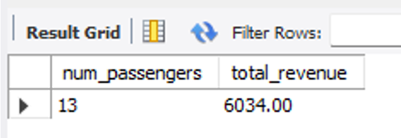
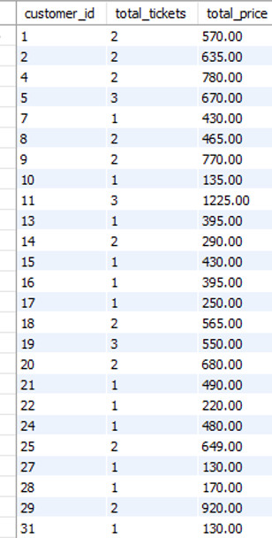
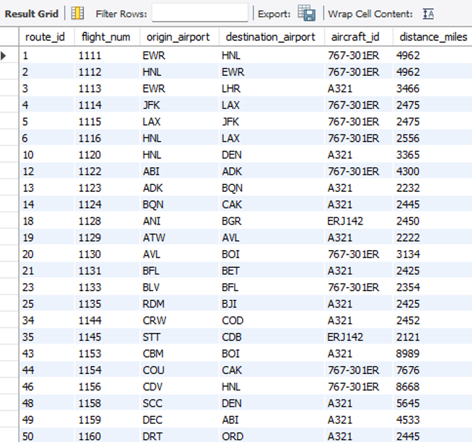

# Air Cargo Analysis - SQL Capstone Project

An end-to-end SQL analytics project exploring air cargo operations, customer patterns, and route performance using MySQL 8.0

## Overview

This project provides a detailed SQL-based analysis of air cargo operations, focusing on route performance, customer spending, and stored procedure–based summaries.  
It demonstrates core SQL skills - database creation, complex queries, joins, views, and procedural logic - executed in MySQL Workbench.

---

## Objectives

- Evaluate air cargo routes based on distance and cargo metrics  
- Identify revenue contribution by ticket class and customer  
- Apply stored procedures for automated reporting  
- Present actionable insights from SQL-based data analysis  

---

## Tools & Technologies

- MySQL 8.0 Workbench  
- CSV imports & relational joins  
- Stored procedures and aggregate functions  
- Analytical queries and view creation  

---

## Datasets

| File | Description |
|------|-------------|
| `customers.csv` | Customer details linked with ticket records |
| `routes.csv` | Flight routes, origin–destination pairs, and distance |
| `passengers_on_flights.csv` | Flight wise cargo and passenger stats |
| `ticket_details.csv` | Booking details and ticket prices |

All datasets were provided under Simplilearn’s Business Analytics with SQL Capstone program for educational use.

---

## Process Summary

- Database and table creation  
- Data import & validation  
- Business analysis queries (Action 4, 16, 17)  
- Stored procedure creation and execution  
- Final report and visual documentation  

---

## Results & Outputs

Below are key results captured from the original project report (MySQL Workbench).

---

### Action 4 — Business Class Passengers & Revenue  

Objective: Calculate total passengers and revenue from Business Class tickets.  
Result: 13 business class passengers generated a total revenue of 6034.00.  

<p align="center">
  <br>
  <em>Figure 1: Business class passengers and total revenue summary (Action 4).</em>
</p>

---

### Action 17 — Customer Tickets and Total Price Summary  

Objective: Determine each customer’s total tickets purchased and total amount paid.  
Result: The output lists all customers with their aggregate ticket count and total spend across flights.  

<p align="center">
  <br>
  <em>Figure 2: Total tickets purchased and total price paid by each customer (Action 17).</em>
</p>

---

### Action 16 — Stored Procedure for Long Routes  

Objective: Retrieve all routes with distance greater than 2000 miles using a stored procedure.  
Result: Procedure executed successfully and returned long-distance route records.  

<p align="center">
  <br>
  <em>Figure 3: Stored procedure output showing routes longer than 2000 miles (Action 16).</em>
</p>

---

All results are sourced from the original Air Cargo Analysis project prepared in MySQL Workbench as part of Simplilearn’s Business Analytics Capstone.

---

## Repository Structure
```
Air-Cargo-Analysis/
├── data/
│ ├── customers.csv
│ ├── routes.csv
│ ├── passengers_on_flights.csv
│ └── ticket_details.csv
├── scripts/
│ └── air_cargo_analysis.sql
├── reports/
│ ├── Air_Cargo_Analysis_Report.pdf
│ └── air_cargo_analysis_problem_statement.pdf
├── assets/
│ ├── business-class-revenue.png
│ ├── top-customers-spend.png
│ └── long-routes-proc.png
└── README.md
```


---

## Author

Ashish Chamel  

LinkedIn: https://www.linkedin.com/in/ashish-chamel
